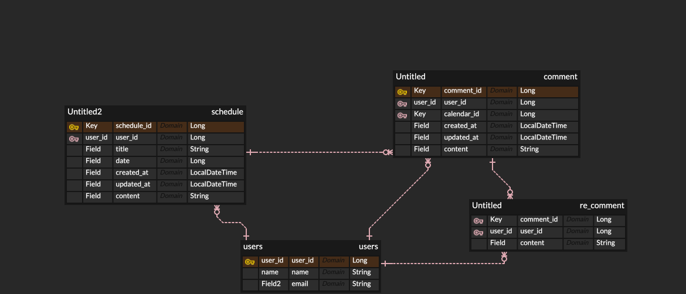

# Schedule Project 
플러스 주차 걷기반 schedule project
| **Method** | **URL**                                    | **Description** | **PathVariable**     | **RequestParam** | **Request Body**                                                   | **Response Body**                                                                                             | **Status Code**   |
|------------|--------------------------------------------|-----------------|----------------------|------------------|---------------------------------------------------------------------|---------------------------------------------------------------------------------------------------------------|-------------------|
| `POST`     | `/api/users`                               | 회원가입         | 없음                 | 없음             | `{"name" : "이름", "email" : "이메일"}`                             | `{"message" : "회원가입이 완료되었습니다"}`                                                                    | `201 CREATED`     |
| `POST`     | `/api/schedules`                           | 일정 작성        | 없음                 | 없음             | `{"title" : "제목", "content" : "내용"}`                            | `{"id":1, "title":"제목", "content":"내용", "createdAt":"2025-04-22"}`                                         | `200 OK`          |
| `PUT`      | `/api/schedules/{scheduleId}`              | 일정 수정        | `scheduleId`         | 없음             | `{"title" : "수정된 제목", "content" : "내용"}`                      | `{"id":1, "title":"수정된제목", "content":"내용", "updatedAt":"2025-04-23"}`                                   | `200 OK`          |
| `DELETE`   | `/api/schedules/{scheduleId}`              | 일정 삭제        | `scheduleId`         | 없음             | 없음                                                               | `{"message" : "일정이 삭제되었습니다"}`                                                                       | `200 DELETED`     |
| `POST`     | `/api/comment/{commentId}`                 | 댓글 생성        | 없음                 | `schedules`      | `{"content" : "댓글내용"}`                                          | `{"contentId" : 1, "content" : "댓글내용", "createAt" : "2025-04-22"}`                                        | `201 CREATED`     |
| `PUT`      | `/api/comment/{commentId}`                 | 댓글 수정        | `commentId`          | `schedules`      | `{"content" : "수정된 댓글내용"}`                                   | `{"scheduleId" : 1, "userId" : 1, "contentId" : 1, "content" : "수정된 댓글내용", "createAt" : "2025-04-30"}` | `200 OK`          |
| `DELETE`   | `/api/comment/{commentId}`                 | 댓글 삭제        | `commentId`          | `schedules`      | 없음                                                               | `{"message" : "댓글이 삭제되었습니다"}`                                                                       | `200 DELETED`     |
| `POST`     | `/api/comment/{commentId}/reComment`       | 대댓글 생성       | 없음                 | `schedules`      | `{"content" : "대댓글 내용"}`                                       | `{"commentId" : 1, "userId" : 2, "recommentId" : 1, "content" : "대댓글내용", "createAt" : "2025-04-30"}`     | `200 OK`          |
| `PUT`      | `/api/comment/{commentId}/reComment`       | 대댓글 수정       | `recommentId`        | `schedules`      | `{"content" : "수정된 대댓글 내용"}`                                | `{"commentId" : 1, "userId" : 2, "recommentId" : 1, "content" : "수정된 대댓글내용", "updateAt" : "2025-05-01"}`| `200 OK`          |
| `POST`     | `/api/comment/{commentId}/reComment`       | 대댓글 삭제       | `recommentId`        | `schedules`      | 없음                                                               | `{"message" : "대댓글이 삭제되었습니다"}`                                                                    | `200 OK`          |
## ERD 
